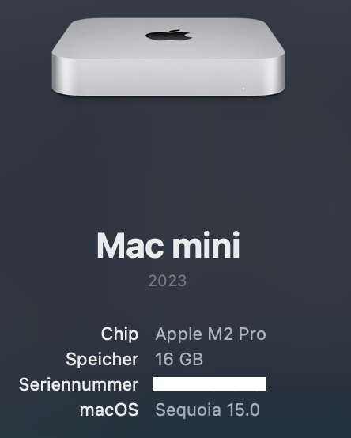
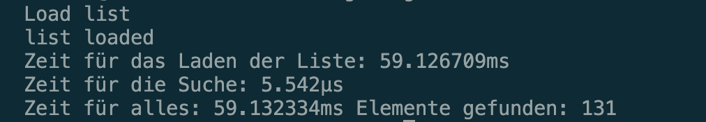
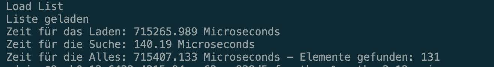
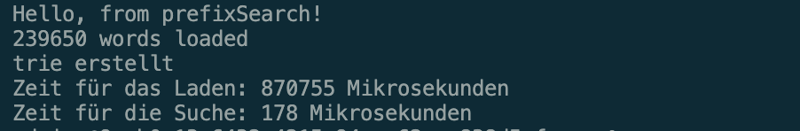
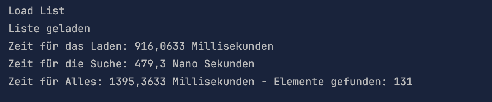
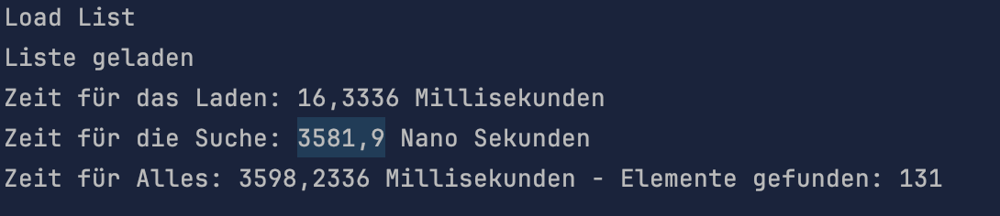
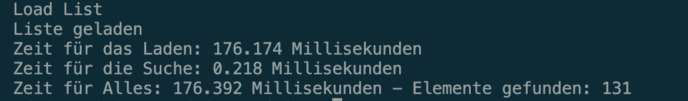

# search_test

## Suche in 240 000 Wörtern nach dem Wort: "Text"

|Language|load|search| LINQ|
|---|---|---|---|
|Go|59ms|6µs||
|Python|723ms|140µs||
|C++|868ms|188µs||
|C#|897ms|426µs|3582µs|
|Nodejs|167ms|218µs||

**Hardware:**

Go Binary Search

Python TrieNode

C++ TrieNode

C# TrieNode

C# LINQ

Node.js TrieNode

